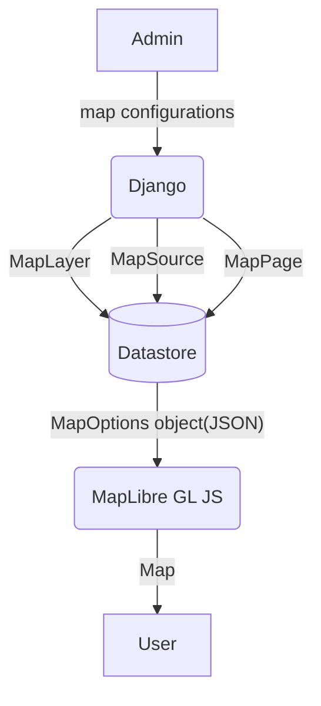

# MapEditor
This application is a Django-based system for managing and hosting map configurations for [MapLibre GL JS](https://github.com/maplibre/maplibre-gl-js). The configurations can be edited using the [django-admin-json-editor](https://pypi.org/project/django-admin-json-editor/) available in the Django admin site.

## Getting started

1. Clone this repogitry. ```git clone https://github.com/zentall/map-editor.git```
2. install modules. ```pipenv install```
3. activate virtual environment. ```pipenv shell```
4. create super user for admin site. ```python manage.py createsuperuser```
5. run dev server. ```python manage.py runserver```
6. login to ```http://localhost:8000/admin/```


## Data flow
