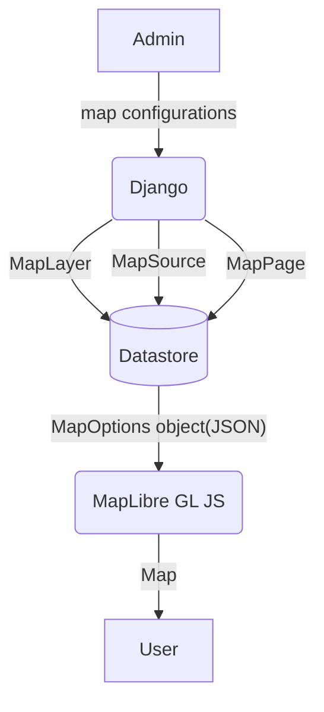

# MapEditor
This application is a Django-based system for managing and hosting map configurations for [MapLibre GL JS](https://github.com/maplibre/maplibre-gl-js). The configurations can be edited using the [django-admin-json-editor](https://pypi.org/project/django-admin-json-editor/) available in the Django admin site.

## Getting started

1. **Clone this repository**  
   ```bash
   git clone https://github.com/zentall/map-editor.git
   ```

2. **Install required modules**  
   ```bash
   pipenv install
   ```

3. **Activate the virtual environment**  
   ```bash
   pipenv shell
   ```

4.  **Create a superuser for the admin site**  
   ```bash
   python manage.py createsuperuser
   ```

5.  **Run the development server**  
   ```bash
   python manage.py runserver
   ```

6.  **Log in to the admin site**  
   Open [http://localhost:8000/admin/](http://localhost:8000/admin/) in your browser and log in using the superuser credentials.

## Data flow
